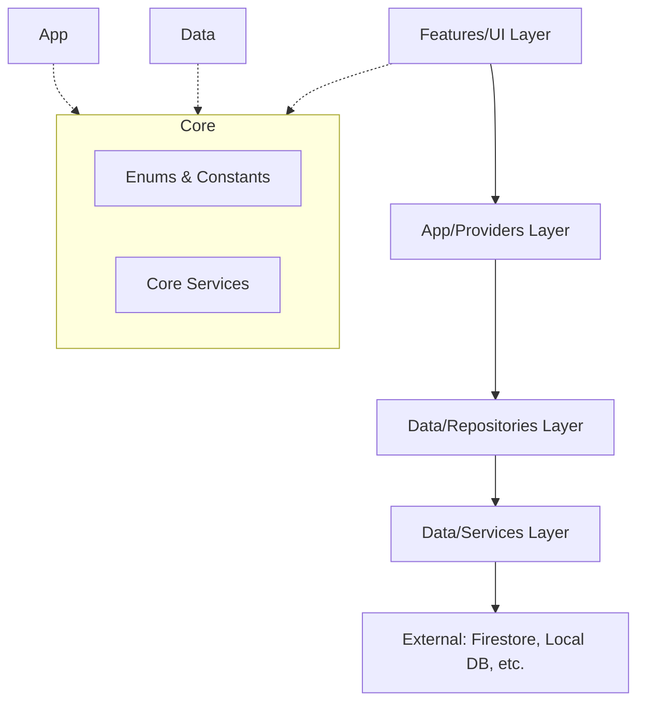

# Project Architecture

SeasonBox follows a **Layered Architecture** inspired by Clean Architecture principles. This ensures a strict separation of concerns, making the codebase maintainable, testable, and scalable.

## Architecture Overview

The application is divided into four main layers, each with a specific responsibility:

---

## 1. Core Layer (`lib/core`)
The foundation of the application. It contains logic and definitions that are used globally across all layers.
- **Enums & Constants**: Shared definitions (e.g., `Gender`, `ItemCategory`).
- **Core Services**: Low-level or cross-cutting logic that doesn't depend on specific data sources (e.g., `PermissionService`, `GrowthPredictionService`).

## 2. Data Layer (`lib/data`)
Responsible for data management and persistence.
- **Services**: Low-level wrappers around external APIs and databases (e.g., `FirestoreService`, `LocalDatabase`).
- **Repositories**: High-level orchestrators. They provide a unified API to the rest of the app, often managing data between local cache and remote sources.
- **Models**: Data structures (classes) used to represent information in the data layer (e.g., `Item`, `FamilyMember`).

## 3. Application Layer (`lib/app`)
Global configuration and app-wide state management.
- **Providers**: Bridges the data layer to the UI. They handle business logic and expose state using `ChangeNotifier` (e.g., `UserProfileProvider`, `ThemeProvider`).
- **Routes & Theme**: Navigation definitions and Material 3 design tokens.

## 4. Features Layer (`lib/features`)
The presentation layer where the UI lives, organized by functional area.
- **Screens**: Full pages (e.g., `HomeScreen`, `AddItemScreen`).
- **Widgets**: UI components specific to that feature.

---

## Why Two "Services" Folders?

| Layer | Responsibility | Example |
| :--- | :--- | :--- |
| **`core/services`** | Logic fundamental to app behavior or system interactions. | `GrowthPredictionService` (Calculations), `PermissionService` (GPS/Photos). |
| **`data/services`** | Direct interaction with external data providers. | `FirestoreService` (Database), `StorageService` (Files), `BiometricService` (Auth). |

This separation ensures that replacing a technology (like moving from Firestore to another database) only requires changes in the `data/` layer, leaving the `core` logic untouched.
